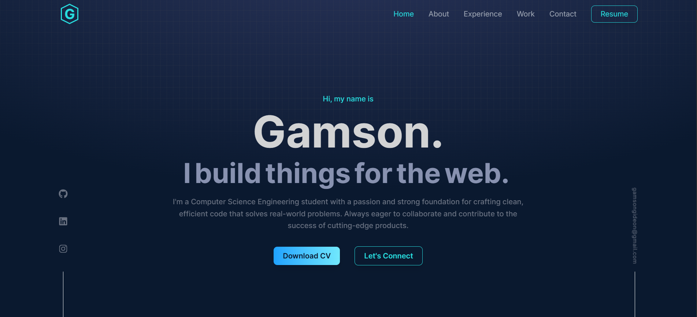

<div align="center">
  
</div>
<h1 align="center">
  Gideon Gamson
</h1>
<p align="center">
  The Second iteration of <a href="https://my-portfolio-v2-gamma-seven.vercel.app/" target="_blank">My Personal Website</a> built with <a href="https://www.react.dev/" target="_blank">React +</a> <a href="https://https://v3.vitejs.dev/guide//" target="_blank">Vite</a> 
  <br>
  styled with <a href="https://tailwindcss.com/" target="_blank" >Tailwind CSS</a>, animated using <a href="https://motion.dev/" target="_blank" >Framer Motion</a>
  and hosted with <a href="https://www.vercel.com/" target="_blank">Vercel</a>
</p>
<p align="center">
  Previous iteration:
  <a href="https://gamson3.github.io/My-Portfolio/" target="_blank">First Version of My Personal Website</a>
</p>
<p align="center">
  <a href="https://vercel.com/gamsons-projects/my-portfolio-v2/deployments" target="_blank">
     
  </a>
</p>




## 🚨 Forking this repo (Kindly read!)

### TL;DR
Yes, you can fork this repo. <br>
If you fork or modify this repository for your own use, please provide proper credit. A simple mention or link back to [My Portfolio v2](https://my-portfolio-v2-gamma-seven.vercel.app/) would be greatly appreciated. Thanks! 

## 🤝 Contributing
Have suggestions for improvements? Feel free to fork this repo, make your changes, and submit a pull request.


## **🛠 Installation & Setup**  

1. Clone the Repository 
   ```sh
    git clone https://github.com/gamson3/My-portfolio-v2.git
    cd My-portfolio-v2
   ```

2. Install Dependencies  
   ```sh
    npm install
   ```

3. Start the Development Server 
    ```sh
    npm run dev
    ```
    Your portfolio will be live at **[http://localhost:5173](http://localhost:5173)** 🎉  NB: This usually varies

## **🚀 Building & Deployment**  

1. Create a Production Build 
    ```sh
    npm run build
    ```

2. Preview the Production Build Locally
    ```sh
    npm run preview
    ```

Once built, deploy it using **Vercel, Netlify, GitHub Pages**, or any static hosting service.  